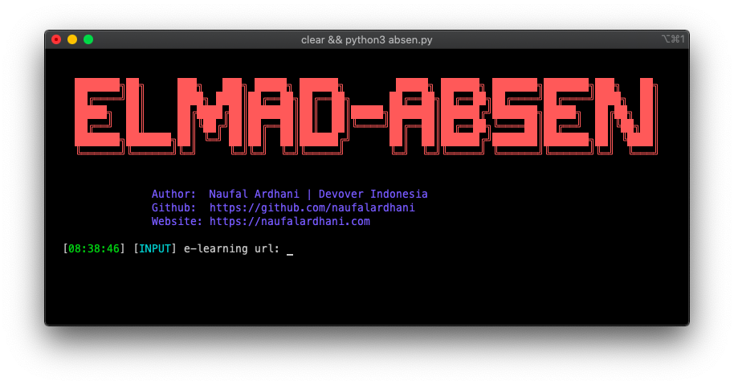

# elmad-absen
Elmad-Absen is an automatic absent tool for E-Learning Madrasah made by Kemenag 

  

# What Are the Advantages?
- Bisa absen semua pelajaran secara langsung

# How To Install:
1. `git clone https://github.com/naufalardhani/elmad-absen.git`
2. `cd elmad-absen && pip3 install -r requirements.txt`

# How To Usage:
1. `cd elmad-absen`
2. `python3 absen.py -url {elearning_url} -nisn {your_nisn} -pass {your_pass}`
3. Choose the day of learning

